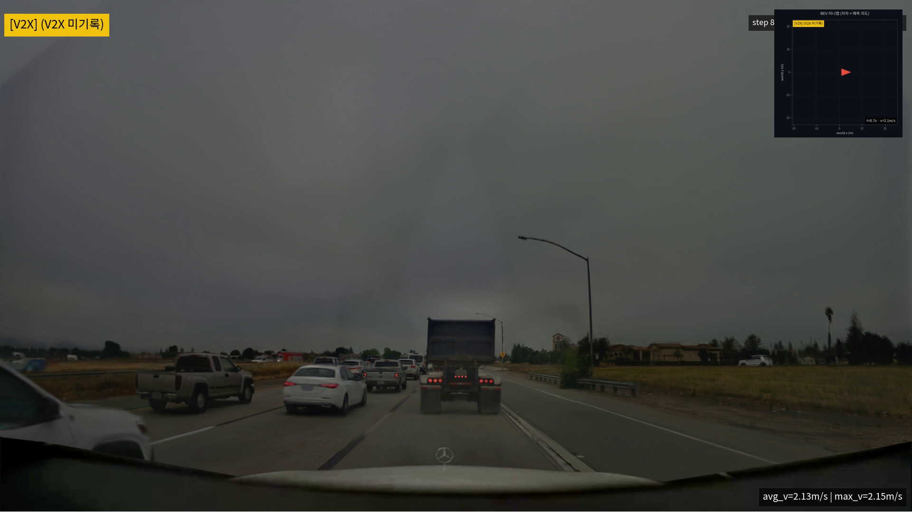
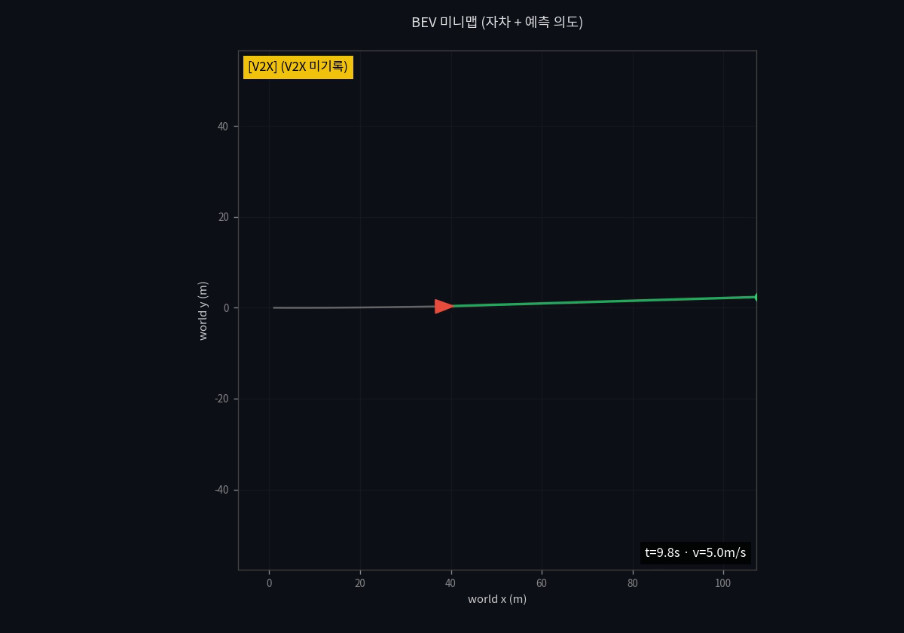

# 한국형 V2X 자율주행 평가 PoC — 본질 정의와 본격 추진 인력 산정 보고

**작성일**: 2026-06-02
**대상**: 전무님
**작성 배경**: 작성자가 KATECH 평가용 PoC 프로토타입을 단독으로 구축하는 과정에서, "이 PoC가 무엇을 위한 도구인가"에 대한 본질이 더 명확히 드러났습니다. 동시에 본격 PoC 단계로 진화시키려면 어떤 산출물이 필요한지, 그것을 만들기 위해 어떤 인력 구성과 일정이 필요한지가 정리되었습니다. 본 보고서는 그 본질 정의와 본격 추진 인력 산정안을 함께 보고드립니다.

---

## 1. TL;DR

- 이 PoC의 본질은 **"V2X 데이터를 받아서, 실제 도로 상황에서 그 데이터들이 돌아가는 환경을 준비해주고, 자율주행 로직 연구자가 그 환경에서 자체 로직을 테스트할 수 있게 해주는 도구"**입니다.
- 작성자가 단독 구축한 **1인 prototype**은 이 가치 흐름의 **모든 구성 요소를 부분적으로** 보여줍니다 (V2X 메시지 흐름·BEV 미니맵·NRE 카메라 렌더·6 평가 탭). 본 보고서 작성 중 추가로 **미니맵+카메라 sync 통합 데모**와 **미니맵-only 1분 30초 영상**도 prototype 단계에서 확보했습니다 (§5 ⓑ).
- 그러나 **연구자가 실제로 자체 로직을 inject·테스트할 수 있는 통합 환경**과 **긴 시나리오를 정량 sweep할 수 있는 데이터셋**은 본격 PoC 단계에서 비로소 완성됩니다.
- 본격 PoC 추진을 위해 **개발자 2 + 기획자 1 + 디자이너 1 + 퍼블리셔 1 = 총 5명 × 3개월 (15 man-month)** 투입을 건의드립니다.

---

## 2. PoC의 본질 — V2X→환경→연구자 테스트

> **이 PoC는 "평가 데모"가 아니라 "V2X-aware 자율주행 테스트 환경 제공 도구"입니다.**

가치 흐름:

```
[V2X 데이터 입력]
   ↓ (한국형 V2X 메시지·시나리오)
[실제 도로 상황 환경 준비]
   ↓ (미니맵 + 카메라 렌더 + 시뮬레이션)
[자율주행 연구자가 자체 로직을 테스트]
   ↓ (시나리오 변형 / 로직 교체 / 결과 비교)
[정량·정성 결과로 V2X 가치 검증]
```

### 왜 이 본질이 중요한가
- **평가위원에게**: V2X 자율주행이 한국 도로에서 어떻게 동작하는지 시각적·정량적으로 확인 가능
- **KATECH 연구자에게**: 본인의 자율주행 로직(인지·판단·제어)을 한국형 V2X 시나리오에서 테스트 가능
- **NVIDIA stack 의존도 분리**: Alpamayo·NRE는 **참고 모델**일 뿐, 본질은 "테스트 환경"이라는 자산

이 본질이 명확해지면 본격 PoC가 무엇을 만들 것인가가 자연스럽게 도출됩니다 (§5).

---

## 3. 현황 — 1인 prototype은 본질의 어떤 부분을 보여주고 있는가

작성자가 단독 구축한 prototype은 본질의 **모든 구성 요소를 부분적으로** 보여주는 데까지 도달했습니다.

| 본질 구성 요소 | prototype 구현 상태 |
|---|---|
| **V2X 데이터 입력** | UI에서 V2X 텍스트 입력 → backend → driver container → Alpamayo VLM 까지 end-to-end 흐름 동작 |
| **도로 상황 환경 준비** | BEV 미니맵(정적) + NRE Closed-Loop 카메라 렌더(단일 카메라 mp4) — **두 시각화는 현재 분리됨** |
| **연구자 테스트** | 6 평가 탭으로 시나리오·V2X·카메라 입력 sweep 등 변형 가능. **단, 연구자 자체 로직 inject 인터페이스는 없음** |
| **결과 비교** | ADE/FDE·BEV 시각화·NRE 영상으로 정량/정성 비교 |

### 의의
- NVIDIA Alpamayo stack이 한국형 V2X 평가에 **실제로 적용 가능함**을 확인
- KATECH 시연 가능 수준에 도달
- 본질의 **구성 요소 5개가 모두 동작**함이 검증됨 (분리 상태일 뿐)

### 한계
부분 동작은 확인했으나, "**연구자가 실제로 사용 가능한 통합 테스트 환경**"은 아닙니다 (§4).

---

## 4. 1인 prototype의 한계 — 본질 관점에서 무엇이 부족한가

### 4-1. 미니맵과 카메라 렌더가 분리됨
- BEV 미니맵(Tab ①, 정적 PNG)과 NRE 카메라 mp4(Tab ⑥)는 **별도 산출물**
- 같은 화면에서 sync되어 동시 재생되지 않음 → 연구자가 "지금 차가 어디 있고 무엇을 보는가"를 한눈에 파악 불가
- timestamp 체계도 다름 (단일 frame 예측 vs ASL 다중 step 시계열)

### 4-2. 연구자가 자체 로직을 inject할 인터페이스 없음
- 현재는 Alpamayo VLM 결과만 표시
- KATECH 연구자가 자체 자율주행 로직(인지·판단·제어 모듈)을 끼워 넣을 SDK/API 부재
- → "테스트 환경"이 아니라 "데모"에 머무름

### 4-3. 기획·디자인·퍼블 영역 부재
- 시나리오·V2X 메시지·평가 지표가 **작성자 단독 주관**
- 시각 디자인 일관성·정보구조도·반응형·접근성 미흡
- 평가위원 인지 부하가 높아 5분 내 가치 전달 어려움

### 4-4. 개발 1인의 한계
- 백엔드(모델 통합) + 프론트(HTMX) + 시스템(cloudflared·캐싱) + 운영(자동 캡처)을 한 사람이 동시에 진행 불가능
- 회귀 테스트·부하 테스트·다중 세션 격리 누락
- 시연 중 장애 발생 시 대응 인력 부재

---

## 5. 본격 PoC 핵심 산출물 — 본질을 완성하는 4가지

본격 PoC는 본질을 완성할 다음 4가지 산출물을 만듭니다.

### ⓐ V2X 시나리오 카탈로그 + 평가위원용 UI
- 한국형 V2X 시나리오 20+개의 가설·메시지·기대 결과를 표준화한 카탈로그
- 평가위원이 시나리오를 선택·V2X 변동을 인터랙티브 조작할 수 있는 UI
- KATECH와 공동 정의 워크샵을 통한 합의 (이 과정 자체가 평가 결과의 권위 확보)

### ⓑ 미니맵 + 카메라 통합 시뮬레이션 환경 ★ (본질의 핵심)

본격 PoC의 가장 중요한 산출물이며, **시연용 high-fidelity 트랙**과 **정량 평가용 light-weight 트랙**으로 이중 분기됩니다.

#### ⓑ-1 High-fidelity sync 트랙 (NRE + 미니맵 sync) — 발표·정성 평가용
- **NRE 카메라 렌더 + BEV 미니맵을 같은 timestamp로 sync 재생** (picture-in-picture 합성)
- 연구자가 한 화면에서 "지금 차가 어디 있고, 무엇을 보고 있고, V2X가 어떤 정보를 주고, 어떻게 판단했는가"를 동시에 관찰
- 비용: rollout당 NRE 합성 8-10분, 시연 효과 최대
- 적합: KATECH 평가위원 시연, 영상 자료, 정성 검증

**prototype 단계 시각 증거**:



> 우상단 BEV 미니맵에 자차(빨강 삼각형)·궤적(회색 선)·V2X 배너가 시계열로 표시되고, 카메라 뷰와 같은 step timestamp로 동시 재생됩니다. (rollout `38e6fafa`, 14 step, 7초)

#### ⓑ-2 Light-weight 미니맵-only 트랙 — 긴 시나리오·정량 sweep용
- **NRE 카메라 합성 단계 skip, 미니맵만 단독 렌더** (ASL trace의 step 데이터만 사용)
- 비용: rollout당 1-2분 (NRE 8-10분 대비 5-10× 단축)
- 적합: 시나리오 카탈로그 sweep·V2X 변동 정량 평가·긴 시뮬레이션 시연

**prototype 단계 시각 증거**:



> 196 step rollout(`27c047f0`)을 미니맵-only로 렌더한 결과. 영상 길이 98초(1분 38초), 1200×840 해상도, 100KB. 자차 trail이 누적되어 전체 궤적을 한눈에 확인 가능.

#### ⓑ-2의 본질적 한계 — NuRec GT 추출 파이프라인이 별도로 필요

> **정직한 보고**: 위 98초 미니맵 영상의 **실제 시뮬레이션 시간은 20초**입니다 (196 step × 100ms control timestep × 2fps 인코딩 → 4× slow-motion 영상). NuRec OSS scene 카탈로그가 모두 20초 고정이라 closed-loop이 그 이상 진행되지 못합니다.
>
> **진짜 1분/5분/30분짜리 연속 시뮬레이션**을 만들려면 본격 PoC에서 별도 작업이 필요합니다:
> 1. NuRec 데이터셋에서 60초+ GT trajectory clip 추출 파이프라인 구축
> 2. 또는 한국 도로 자체 녹화 데이터로 NuRec 데이터셋 확장 (KATECH 협업 가능)
> 3. Alpasim wizard에 시간 한계 hydra override 노출
>
> 이 작업은 **본격 PoC 산출물 ⓑ-2의 핵심 의존성**이며, 모델·시각화 작업과 병행되어야 합니다.

#### ⓑ 산출물 공통
- 산출 스크립트: `scripts/render_minimap_camera_sync.py` (`--minimap-only` 옵션으로 두 트랙 모두 지원)
- UI 노출: Tab ⑥ "▶ 미니맵 + 카메라 sync" (high-fidelity) — light-weight 트랙은 평가용 별도 페이지 필요

### ⓒ 연구자 SDK/API
- Python API: 시나리오 로드 → 자율주행 로직 inject → 시뮬레이션 실행 → 결과 수집
- 인지/판단/제어 모듈을 **swappable** 형태로 설계
- Alpamayo VLM은 **기본 baseline**이고, 연구자는 자체 로직으로 대체·비교 가능
- 본격 PoC의 **사용자 가치**가 여기서 결정됨

### ⓓ 결과 분석·비교 대시보드
- 시나리오 × 로직 × V2X 변동 조합별 결과 비교
- ADE/FDE·안전 지표·counterfactual 차이를 한눈에
- KATECH 자체 평가 보고서로 export 가능

---

## 6. 본격 PoC 구성 — 5개 역할의 협업 흐름

```
[기획(시나리오·연구자 요구사항)]
   ↓
[디자인(IA·sync UI·SDK 문서·시각)]
   ↓
[퍼블(마크업·반응형·접근성)]
   ↓
[개발 1(백엔드·모델·SDK) + 개발 2(프론트·sync UI·시스템)]
   ↓ (피드백 루프)
[KATECH 연구자 인터뷰·시연 검증]
```

각 역할이 빠지면 본 보고서 §4의 한계가 그대로 재현됩니다. 5개 역할은 **서로 대체 불가능**합니다.

---

## 7. 역할별 R&R

### ① 개발자 1 — 백엔드 · 모델 · SDK (Senior)
**책임 영역**
- Alpamayo 1.5 / Cosmos-Reason2 적재·추론 파이프라인
- FastAPI 백엔드, ASL 프로토콜 파서, vllm 통합
- NRE Closed-Loop 연동, 사전 캐싱 파이프라인
- **연구자 SDK/API 설계·구현** (산출물 ⓒ)
- 모델 회귀 테스트, 운영 매뉴얼

**핵심 산출물**: 모델 inference API · NRE 파이프라인 · 연구자 SDK · 캐싱 시스템

### ② 개발자 2 — 프론트 · sync UI · 시스템 (Mid–Senior)
**책임 영역**
- HTMX 흐름 제어, 상태 관리, 라우팅
- **미니맵 + 카메라 sync 통합 UI 구현** (산출물 ⓑ)
- 자동 시연 / 인터랙티브 / VQA / 카메라 sweep 통합
- 자동 캡처 파이프라인, cloudflared tunnel 운영
- 결과 비교 대시보드 구현 (산출물 ⓓ)

**핵심 산출물**: sync 통합 시뮬레이션 UI · 비교 대시보드 · 자동 캡처 파이프라인

### ③ 기획자 1
**책임 영역**
- KATECH 평가위원·연구자 페르소나·사용자 분석
- **V2X 시나리오 카탈로그 정의** (산출물 ⓐ)
- 평가 지표 정의 (ADE / FDE / 카메라 sweep / V2X counterfactual)
- KATECH 공동 정의 워크샵 운영
- 연구자 인터뷰·SDK 요구사항 수집

**핵심 산출물**: 사용자 분석 · 시나리오 카탈로그 · 지표 정의서 · 워크샵 결과물

### ④ 디자이너 1
**책임 영역**
- 정보구조도 / 와이어프레임
- **sync 통합 UI 시각 디자인** (BEV·카메라·오버레이 톤 일관성)
- **연구자 SDK 문서 디자인** (코드 예시·다이어그램)
- 컴포넌트 시스템, 발표 자료 디자인

**핵심 산출물**: IA · 와이어프레임 · 비주얼 가이드 · SDK 문서 디자인 · 발표 자료

### ⑤ 퍼블리셔 1
**책임 영역**
- 디자인 시스템 → HTML/CSS 마크업 구현
- 평가 탭 + sync UI + 대시보드 퍼블리싱
- 반응형, 접근성 (WCAG), 브라우저 호환성
- SDK 문서 페이지 퍼블리싱

**핵심 산출물**: 마크업 셋 · 퍼블 가이드 · 접근성 보고서

---

## 8. 월별 WBS — 3개월 × 5역할 × 산출물 ⓐⓑⓒⓓ

|  | 1개월차 (구축) | 2개월차 (통합) | 3개월차 (안정화·발표 준비) |
|---|---|---|---|
| **기획** | 사용자 분석<br>**시나리오 카탈로그 ⓐ 가설 정의** | V2X 메시지 셋·평가 지표 정의서<br>연구자 인터뷰 → **SDK ⓒ 요구사항** | KATECH 공동 정의 워크샵<br>시나리오·지표 최종 합의 |
| **디자인** | 정보구조도<br>와이어프레임 | 시각 디자인<br>**sync UI ⓑ 디자인**<br>**SDK 문서 ⓒ 디자인** | **대시보드 ⓓ 디자인**<br>발표 자료 |
| **퍼블** | 디자인 시스템 적용<br>마크업 골격 | 평가 탭 퍼블<br>**sync UI ⓑ 마크업** | **SDK 문서 페이지**<br>**대시보드 ⓓ 퍼블**<br>접근성 검수 |
| **개발 1**<br>(백엔드·모델·SDK·데이터) | Alpamayo·Cosmos 적재<br>ASL 파서, vllm<br>**NuRec GT 추출 파이프라인 ⓑ-2** | NRE 통합 (ⓑ-1)<br>**긴 GT scene 카탈로그 ⓑ-2**<br>사전 캐싱<br>**SDK ⓒ 골격** | **SDK ⓒ 완성**<br>회귀 테스트<br>운영 매뉴얼 |
| **개발 2**<br>(프론트·sync·시스템) | FastAPI/HTMX 골격<br>6 탭 라우팅 | **sync UI ⓑ-1 통합**<br>**미니맵-only 페이지 ⓑ-2**<br>인터랙티브·VQA·카메라 sweep | **대시보드 ⓓ 통합**<br>자동 캡처<br>cloudflared·부하 |

### 마일스톤
- **M1 (1개월 말)**: 기획·디자인 80% + 개발 골격 동작 (단일 탭 end-to-end)
- **M2 (2개월 말)**: ⓐ 카탈로그 + ⓑ sync UI 통합 + ⓒ SDK 골격 동작
- **M3 (3개월 말)**: ⓐⓑⓒⓓ 4개 산출물 완성 + KATECH 시연·연구자 시범 사용 가능 상태

---

## 9. 전무님께 드리는 권고

### 9-1. 인력 확보
1. **개발자 2명 우선 확보** — 모델·SDK Senior 1명, sync UI·시스템 Mid-Senior 1명
2. **기획자 1명** — V2X·자율주행 도메인 + 연구자 인터뷰 경험
3. **디자이너 1명 + 퍼블리셔 1명** — 평가 플랫폼·대시보드 경험 우대

### 9-2. 일정 권고
- **3개월 통합 추진**이 가장 효율적 (단계 분리 시 컨텍스트 비용 발생)
- KATECH 공동 정의 워크샵을 **2개월차 말**에 배치 → 3개월차에 결과 반영

### 9-3. 우선순위
- **1순위**: 산출물 ⓑ-1 **NRE+미니맵 sync 통합** — PoC 본질·시연 핵심
- **1순위 병행**: 산출물 ⓑ-2 **NuRec GT 추출 파이프라인 + 미니맵-only 트랙** — 정량 sweep·긴 시나리오 시연 핵심
- **2순위**: 산출물 ⓒ **연구자 SDK** — KATECH 연구자 직접 가치
- **3순위**: 산출물 ⓐ **시나리오 카탈로그** — 권위 확보
- **4순위**: 산출물 ⓓ **결과 대시보드** — 최종 검증·발표

### 9-4. 리스크 관리
- **모델 stack 의존도 분리**: Alpamayo·NRE는 baseline일 뿐, SDK가 swappable이어야 함
- **KATECH 합의 시점 확보**: 2개월차 워크샵에서 시나리오·지표 사전 합의 → 평가 결과 신뢰도
- **차세대 모델 로드맵 동기화**: Alpamayo/Cosmos 차세대 출시 시 인터페이스 표준화로 갈아끼움 가능하게
- **데이터셋 길이 한계**: 현재 NuRec OSS scene이 모두 20초 고정 — ⓑ-2 light-weight 트랙의 핵심 의존성. 1개월차에 GT 추출 파이프라인 착수 못 하면 3개월차 시연·정량 sweep 모두 영향. KATECH의 한국 도로 녹화 데이터 협업이 risk hedge가 될 수 있음

---

## 10. 결론

이번 1인 prototype은 **본질의 모든 구성 요소를 부분적으로** 동작시켜 가능성을 검증했습니다. 그러나 본격 PoC 단계는 **본질을 완성**하는 작업입니다.

> **"prototype은 '이런 것이 가능하다'를 보여줬고, 본격 PoC는 '연구자가 실제로 쓸 수 있는 환경'을 만듭니다."**

본 인력 산정안 (5명 × 3개월 = 15 man-month)은 산출물 ⓐⓑⓒⓓ 4가지를 모두 완성하기 위한 최소 구성입니다. 검토와 승인을 부탁드립니다.

---

*작성: NVIDIA Alpamayo 1.5 PoC 프로토타입 작성자*
